# imdb_bloc

An flutter copy of the IMDb app, using the [flutter_bloc](https://pub.dev/packages/flutter_bloc) package as state management tool.
| Function                    | Status   |
| --------------------------- | -------- |
| Signing in / up             | Finished |
| Collection                  | Finished |
| Detail page                 | Finished |
| Trailer playing             | Finished |
| Reviews viewing/ publishing | Finished |
| Rating                      | Finished |

## Screenshots

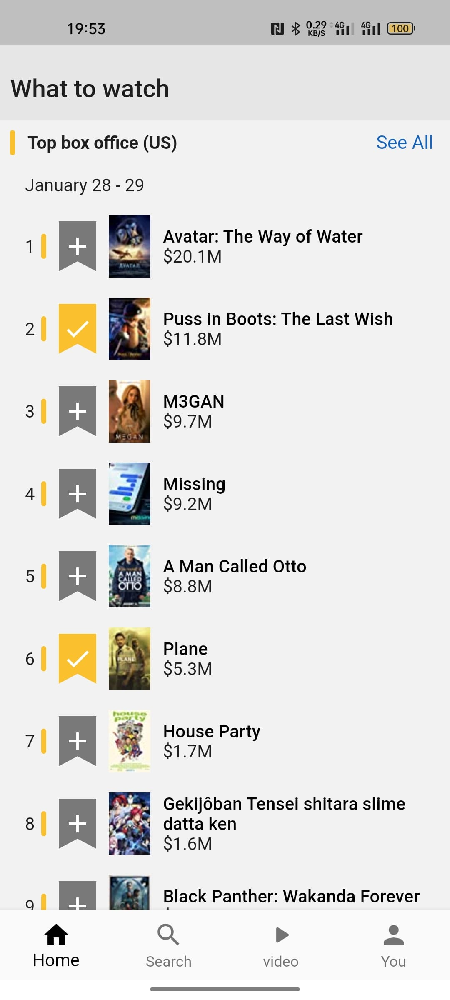

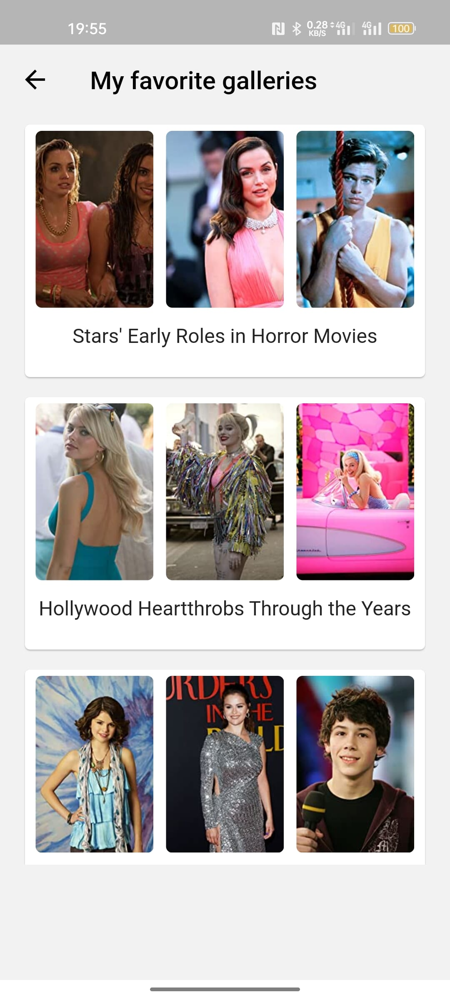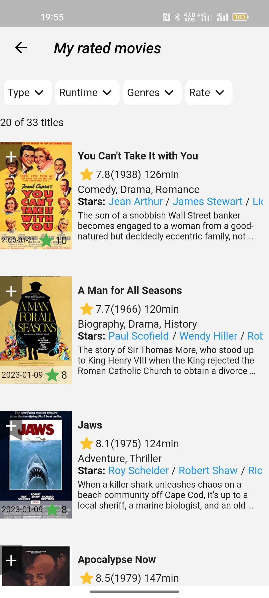

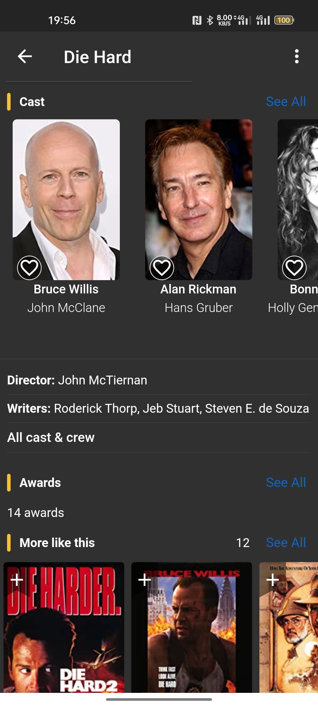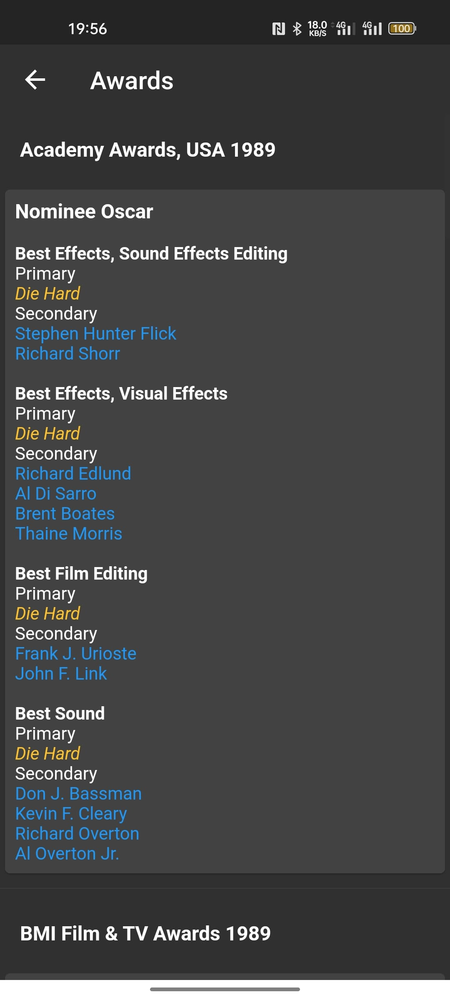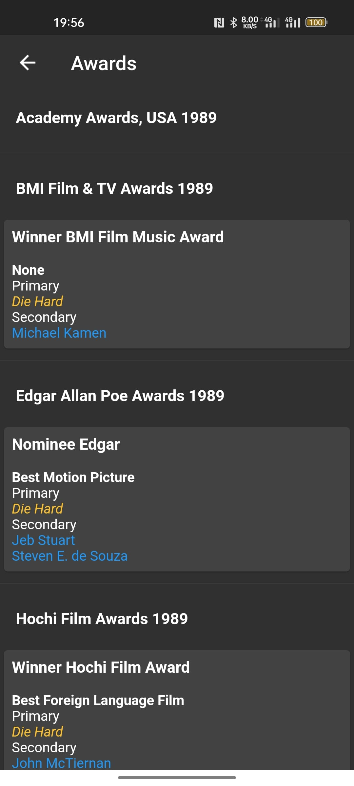
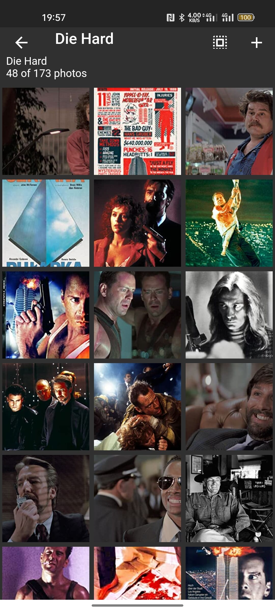
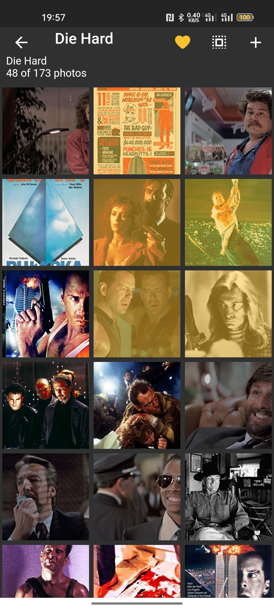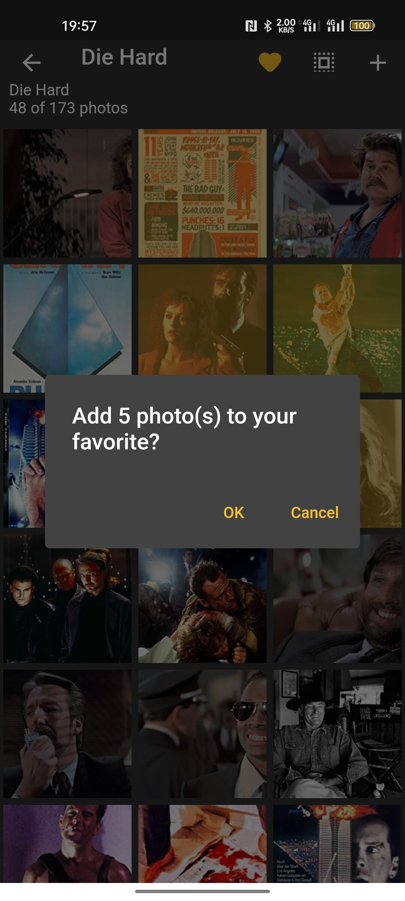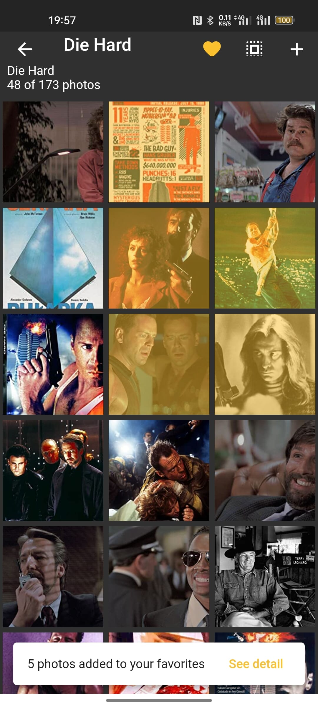
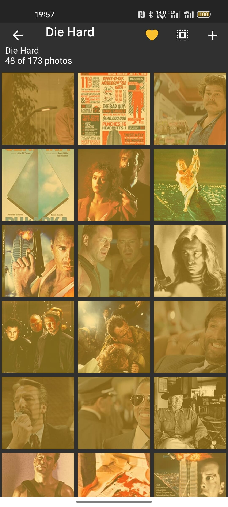
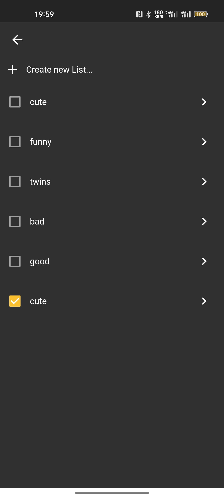

